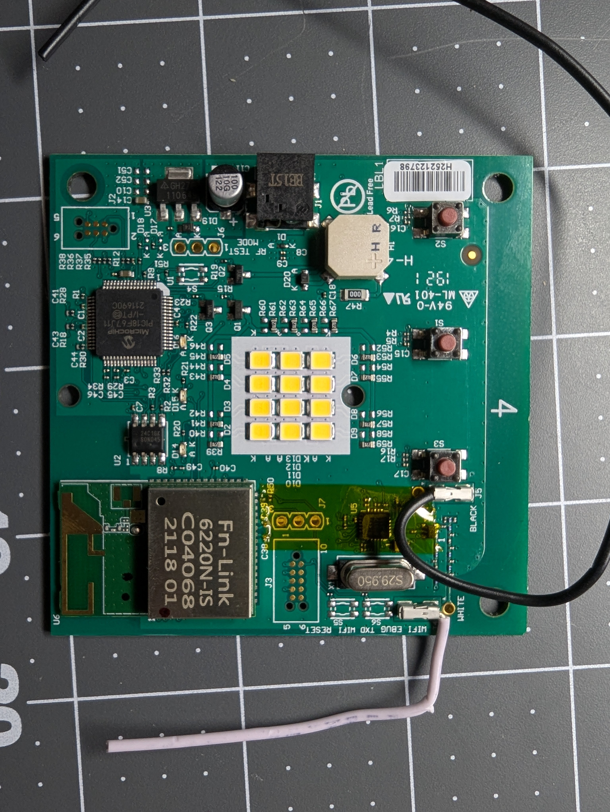
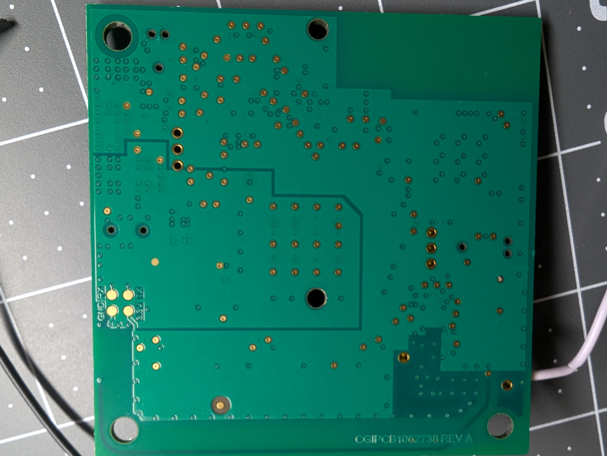
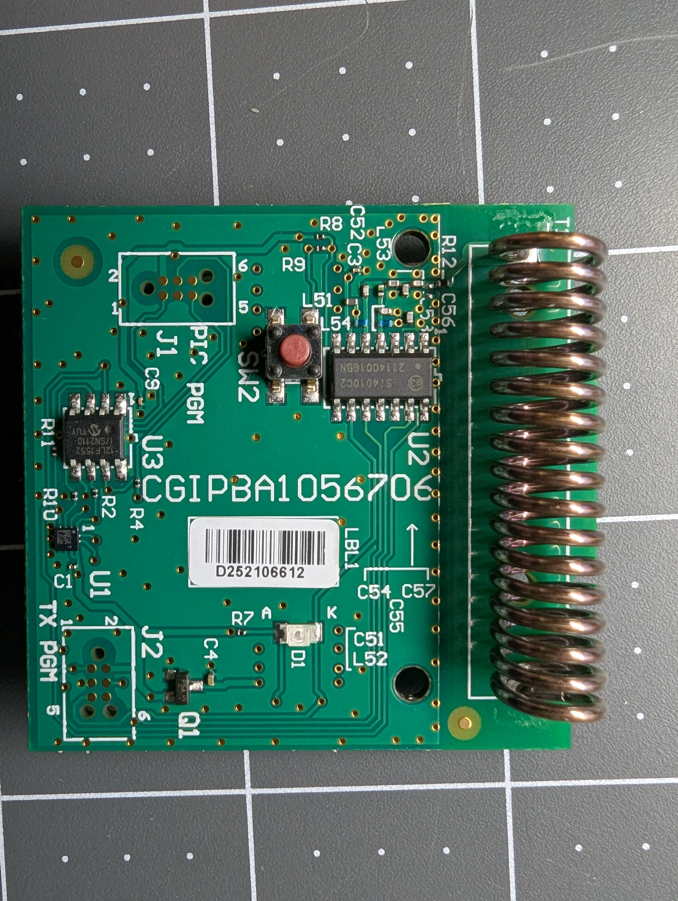
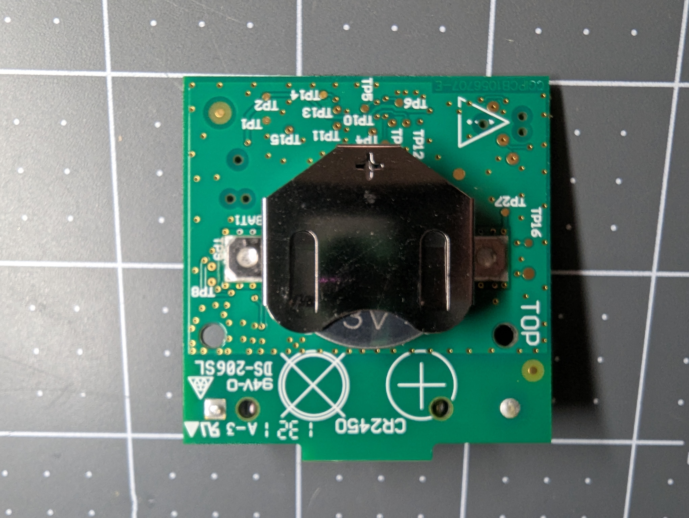

# Chaimberlain MyQ Standalone Teardown Notes

## Metadata

| Field | Value |
|---|---|
| Device | Chaimberlain MyQ standalone smart garage door opener |
| Model / Part Number | Primary - `MYQ-G0401-ES` Secondary - `MYQ-G0402` |
| Firmware Version | Unknown |
| Started | 2026-03-29 |

---

## Worklog

**2026-03-29**
- Physical hardware teardown

## Status & Next Steps

**Current Phase:**
- [X] Recon
- [ ] Active
- [ ] Done

**Next Steps:**
- [ ] Validate Board 1 UART
- [ ] Identify Board 1 ports (JTAG?)
- [ ] Board 1 / Board 2 FW dump
- [ ] "RF Test mode" jumper on board 1

---

## Physical Access

### Disassembly - Board 1

**Tools needed:** 
- T15 Torx screwdriver
- Pry tool

**Steps:**
1. Remove 2xT15 screws from case
2. Open case
3. Remove plastic switch peice with prybar
4. Release board with latch near 10p debug port

**Notes / gotchas:** 
- Wire antennas can be twisted + pulled to release from clamps

**Reassembly notes:** 
- None

**Photos:**
- 
- 

### Disassembly - Board 2

**Tools needed:** 
- Pry tool

**Steps:**
1. Pry back off of case
2. Release board with clip on left side

**Notes / gotchas:** 
- Board tends to stick on plastic alignment pins. May need prying

**Reassembly notes:** 
- None

**Photos:**
- 
- 
---

## Component Inventory

### Board 1

| Component | Function | Datasheet |
|---|---|---|
| PIC18F67J11 | Primary MCU |  [Datasheet](datasheets/39778e.pdf) |
| Fn-Link 6220N-IS | Wifi/Bluetooth Controller | [Datasheet](datasheets/Fn-Link_6220N-IS_datasheet_V6.3_20241105.pdf) |

### Board 2

| Component | Function | Datasheet |
|---|---|---|
| PIC12LF1552 | Primary MCU | [Datasheet](datasheets/40001674F.pdf) |
| Si4010C2 | RF Transmitter | [Datasheet](datasheets/Si4010.pdf)

---

## Debug Interfaces

### [Interface Type — e.g. UART]

- **Location on board:** [e.g. J3 header, top-left near MCU]
- **Pinout:** [e.g. Pin 1: VCC, Pin 2: TX, Pin 3: RX, Pin 4: GND]
- **Speed / settings:** [e.g. 115200 8N1]
- **Findings:** [what you got — boot log, shell, nothing, etc.]
- **Files:** [inline links to captures/logs, e.g. [boot.log](outputs/boot.log)]

### [Interface Type — e.g. SWD / JTAG]

- **Location on board:**
- **Pinout:**
- **Speed / settings:**
- **Findings:**
- **Files:**

---

## Firmware

- **Extraction method:** [e.g. SWD memory read via OpenOCD, UART xmodem, chip-off]
- **Tool / command:** [e.g. `openocd -f interface/stlink.cfg -f target/stm32f1x.cfg -c "program dump.bin 0x08000000 0x80000 verify exit"`]
- **Memory map:**

| Region | Start | End | Notes |
|---|---|---|---|
| [e.g. Flash Bank 0] | [e.g. 0x08000000] | [e.g. 0x0807FFFF] | |

- **Dump files:** [e.g. [stm32_bank_0_dump.bin](outputs/stm32_bank_0_dump.bin)]
- **Strings / symbols of interest:**
  - `[e.g. "AT+CWJAP" — WiFi credentials sent in plaintext]`
  - `[e.g. "/etc/passwd" — hints at Linux userspace]`

---

## Wireless

### [Protocol — e.g. Bluetooth LE]

- **Chip:** [e.g. EMW3239]
- **Observations:** [what traffic / behavior was seen]
- **Tools used:** [e.g. Wireshark + nRF Sniffer, bettercap]
- **Files:** [inline links to captures]
- **Findings:** [anything actionable]

### [Protocol — e.g. WiFi 802.11]

- **Chip:**
- **Observations:**
- **Tools used:**
- **Files:**
- **Findings:**

---

## Findings

_Consolidated actionable findings. What was found and what it enables — no severity ratings or CVE format needed._

- **[Finding title]:** [description + what it enables, e.g. "Unauthenticated UART shell: full root shell accessible without disassembly via J3 header"]

---

## Notes / Scratch

_Free-form. Dead ends, half-formed observations, questions to revisit._

_[your notes here]_
